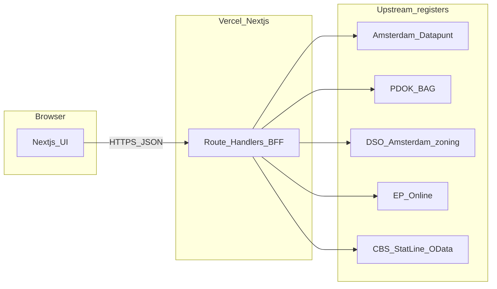
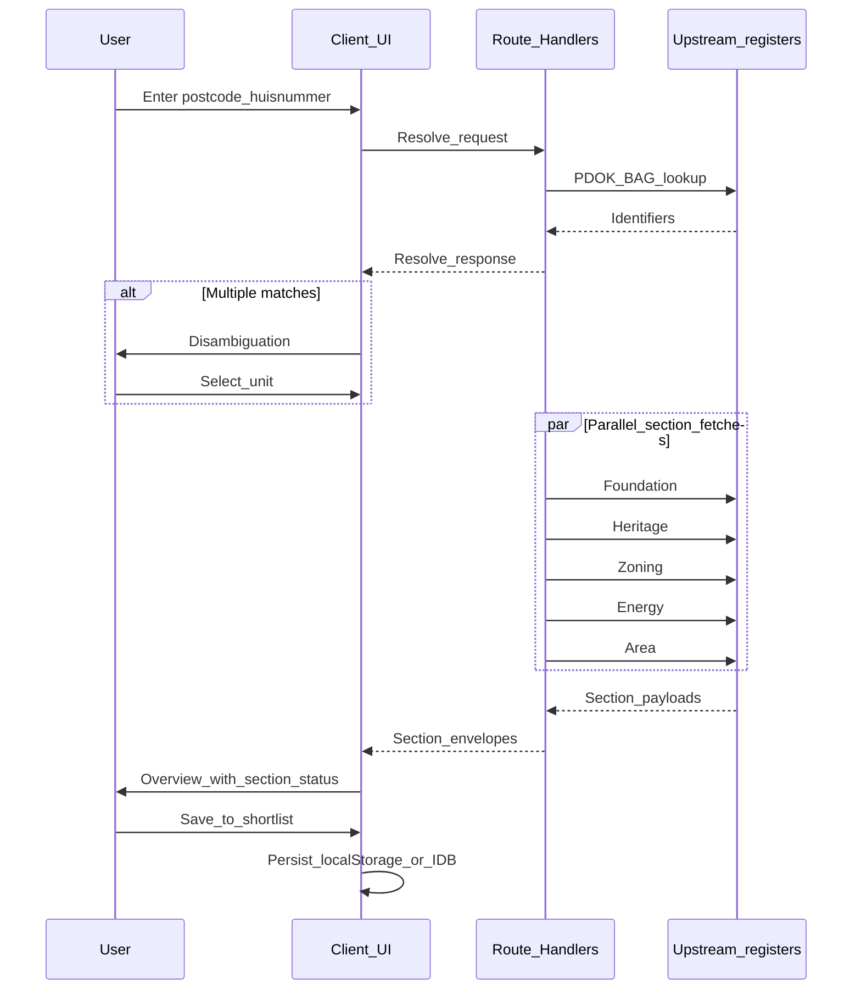

# Architecture — Gracht Dossier v1

**Status:** Technical blueprint for initial build  
**Companion:** [Product specification v1](PRODUCT_SPEC_V1.md) (flows, success criteria, compliance)  
**Last updated:** 2026-04-05

This document describes **how** we implement the product spec: system boundaries, routing, BFF (Route Handlers), logical data shapes, and deployment. It does not restate product goals; refer to the spec for user-facing scope.

---

## 1. Architectural constraints (from spec)

These are **non-negotiable** boundaries inherited from [§4 and §6 of the spec](PRODUCT_SPEC_V1.md):

| Constraint | Implication |
|------------|-------------|
| No native apps in v1 | Responsive web only; optional PWA later. |
| No user accounts or cloud sync | Shortlist lives **only** in the browser (`localStorage` or IndexedDB). |
| No listing portal integration | No Funda-style scrapes or APIs in scope. |
| Informational product only | Disclaimers in layout + memo; no “advice” copy in architecture. |
| Gaps in registers are normal | Every section supports **loaded / error / empty (unknown)** in the API contract and UI. |
| Secrets and upstream calls | **Server-only:** API keys and proxy calls from Next.js Route Handlers; **never** expose keys to the client bundle. |

---

## 2. System context



- **Client:** React Server Components + Client Components as needed; fetches go to **same-origin** `/api/*` (or `app` route handlers under equivalent paths).
- **Server:** All outbound calls to Amsterdam, PDOK, zoning, EP-Online, and CBS originate here. Environment variables for keys (e.g. Datapunt) are set in **Vercel project settings** and local `.env.local`; they are **not** prefixed with `NEXT_PUBLIC_`.

---

## 3. Frontend architecture (Next.js App Router)

### 3.1 Route convention

| Route | Purpose |
|-------|---------|
| `/` | Shortlist home: add address, disambiguation, list of saved properties. |
| `/property/[id]` | Property detail: sections (Overview, Foundation, Heritage, Zoning, Energy, Area) with source, timestamp, retry. |
| `/compare` | Multi-select from shortlist (2–8); comparison table + cell sheet. |
| `/memo/[id]` | Print-optimized investment memo (browser Print → PDF in v1). |

`[id]` is a **client-stable id** (see §5): not necessarily the raw BAG id in the URL if we prefer opaque ids for bookmarks; the doc assumes one canonical `propertyId` string stored in the shortlist.

### 3.2 UI composition

- **Root layout:** global nav, footer with **provenance / disclaimer** hook (spec §6).
- **Section card pattern (reusable):** title, body, **source name + link**, **last fetched timestamp**, **Retry** action, and visual state for loaded / error / empty.
- **Optional map (v1 or later):** isolated client component or route segment; see §8. If absent, Overview still shows chips and identifiers.

### 3.3 Client persistence (shortlist)

- **Storage:** `localStorage` (simple) or **IndexedDB** (if payload size or structure grows). Pick one for v1 and document in README.
- **Sync with URLs:** opening `/property/[id]` or `/memo/[id]` for an id **not** in storage shows an empty or recoverable state (message + link back to shortlist).

---

## 4. Backend / BFF layer (Route Handlers)

### 4.1 Principles

- **Normalize responses** so the UI does not parse five different error styles from upstream.
- **Caching (v1):** optional short TTL on read-heavy public endpoints (e.g. PDOK) via `Cache-Control` or in-memory; **respect Datapunt rate limits**—prefer minimal retries and clear error to UI.
- **Node runtime (default):** use the Node.js runtime for Route Handlers that call OData, long timeouts, or complex parsing. Edge is optional later if profiling shows benefit.

### 4.2 Suggested handler paths and upstream mapping

Exact file paths follow Next.js App Router conventions (`app/api/.../route.ts`). Names below are **logical** paths.

| Handler area | Example path | Upstream / role | Auth (server env) |
|--------------|--------------|-----------------|-------------------|
| Resolve | `POST /api/resolve` or `GET /api/resolve?...` | PDOK Locatieserver / BAG APIs → building/address identifiers | None for public PDOK; key only if a gated endpoint is used |
| Foundation | `GET /api/property/:id/foundation` | Amsterdam Datapunt — Funderingen | Placeholder: `AMSTERDAM_DATAPUNT_API_KEY` (final name in README) |
| Heritage | `GET /api/property/:id/heritage` | Monumenten, Kwaliteitsmonitor-linked data | Same or separate keys per Amsterdam product |
| Zoning | `GET /api/property/:id/zoning` | DSO / Amsterdam bestemmingsplan APIs | Per upstream requirements |
| Energy | `GET /api/property/:id/energy` | EP-Online (per current RVO rules) | If registration required, server-only token/secret |
| Area | `GET /api/property/:id/area` | CBS StatLine OData | None typically; attribute CBS in response metadata |

**Resolve pipeline:** postcode + huisnummer (+ toevoeging) → geocode / lookup → **stable ids** (e.g. `nummeraanduidingId`, `verblijfsobjectId`, `pandId` as available) passed to section handlers or embedded in `propertyId` server-side mapping.

### 4.3 Normalized section response contract

Every section endpoint returns JSON shaped for the section card:

```typescript
type SectionStatus = "loaded" | "error" | "empty";

interface SectionEnvelope<T> {
  status: SectionStatus;
  data: T | null;
  source: { name: string; url: string };
  fetchedAt: string; // ISO 8601
  error?: { code: string; message: string };
}
```

- **`empty`:** upstream responded successfully but no applicable record (e.g. no energy label).
- **`error`:** network, rate limit, or unexpected upstream failure after bounded retries.
- **Stubbed sections in v1:** may return `empty` or `error` with a fixed message and still include **provenance** (spec §8).

---

## 5. Logical data model

### 5.1 `ShortlistEntry` / persisted shape

Minimal fields so Compare and Memo stay aligned:

| Field | Description |
|-------|-------------|
| `propertyId` | Stable string; primary key in client store and in URLs. |
| `nickname` | Optional user label. |
| `addressLabel` | Display string (e.g. street + number + city). |
| `postcode`, `huisnummer`, `huisletter`, `huisnummertoevoeging` | As entered or normalized from resolve. |
| `bagIds` | Optional object: e.g. `nummeraanduidingId`, `verblijfsobjectId`, `pandId` when known. |
| `sections` | Optional map of cached `SectionEnvelope` payloads to avoid refetch on navigation (implementation choice). |
| `updatedAt` | ISO timestamp of last local change. |

### 5.2 `PropertyRecord` (in-memory / merged view)

What the detail and memo pages **render** from: `ShortlistEntry` + fresh or cached section results:

- Identifiers and overview chips.
- Six section slots: `overview`, `foundation`, `heritage`, `zoning`, `energy`, `area` — each `SectionEnvelope<...>` with typed `data` per section.

### 5.3 Compare

- **Input:** ordered list of `propertyId` from shortlist (2–8).
- **Columns:** mirror detail sections (foundation class, monument flags, stadsgezicht, energy label, zoning one-liner, CBS snapshot fields, etc.).
- **Highlight differences:** pure client-side transform over the table matrix (spec §5.3).
- **Cell sheet:** reads from the same `PropertyRecord` fragment + source link.

### 5.4 Investment memo

- **Route:** `/memo/[id]` renders a **long, print-first** layout (CSS `@media print`, page breaks).
- **Content:** same facts as detail; optional toggles (sections on/off, Executive vs Technical) via query params or client state; **server-generated PDF deferred** unless explicitly added later (spec §9).

---

## 6. Cross-cutting concerns

| Topic | Approach |
|-------|----------|
| Provenance | Every section envelope carries `source.name` and `source.url`; memo repeats attribution blocks. |
| Disclaimers | Shared footer component + memo header/footer: **not structural, legal, or investment advice** (spec §6). |
| Observability | Log handler failures with route name and anonymized id (no PII in logs); no mandatory APM in v1. |
| i18n | English-first copy in components; keep user-visible strings colocated or in a simple dictionary for later Dutch. |
| Security | No secrets in client; validate and sanitize query/body inputs on resolve; timeouts on upstream `fetch`. |

---

## 7. Deployment (Vercel Hobby)

| Item | Detail |
|------|--------|
| Hosting | Vercel; default `*.vercel.app` until custom domain (spec §7). |
| Build | `next build`; Node version per Vercel default or `engines` in `package.json` when added. |
| Env vars | **Server-only** keys for Datapunt and any gated EP-Online usage; never `NEXT_PUBLIC_*` for secrets. |
| Runtime | Prefer **Node** for Route Handlers touching OData and multi-hop registers. |

---

## 8. Open decisions (spec §9) and recommended defaults

| Decision | Recommended default for v1 | Rationale |
|----------|---------------------------|-----------|
| Map in v1 | **Defer map** (no MapLibre/PDOK tiles) | Ship resolve + sections faster; Overview uses chips and ids. |
| UI kit (e.g. shadcn/ui) | **Optional** | Tailwind-only is fine; add shadcn if velocity benefits. |
| Server PDF | **Print-only** | Spec v1 uses browser Print → PDF; library-based PDF in v1.1+ if needed. |

---

## 9. Sequence: add property to overview



---

## 10. Document success criteria

A new contributor should be able to answer:

1. **Where** each property detail section gets its data and **which handler** fronts it.
2. **How** the shortlist is stored and how `propertyId` ties together detail, compare, and memo.
3. **Where** secrets live and that the browser never sees them.

For product flows and acceptance checklist, see [PRODUCT_SPEC_V1.md](PRODUCT_SPEC_V1.md).
